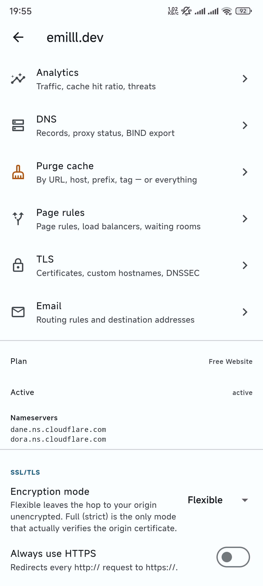
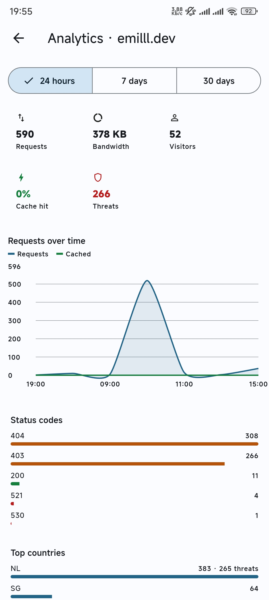
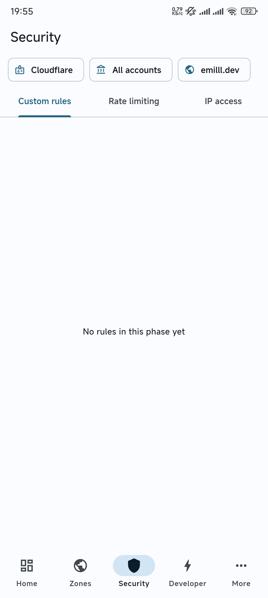
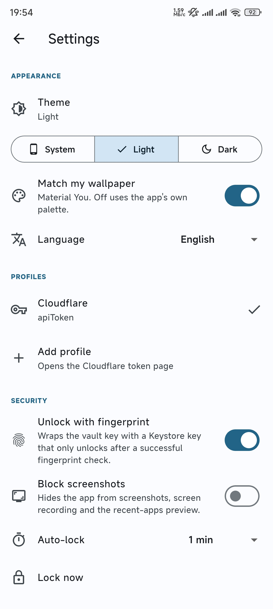

# Cloudflare Mobile

An open-source Android client for managing Cloudflare. Zones, DNS, cache — plus
a schema-aware explorer that reaches **every one of the 3240 endpoints** in the
Cloudflare API, not just the ones with a hand-built screen.

> Not affiliated with, endorsed by, or sponsored by Cloudflare, Inc.
> "Cloudflare" is a trademark of Cloudflare, Inc.

> **Vibe coded.** I built this by vibe coding it, start to finish — the
> architecture, the generator, the screens, the tests. That is not a disclaimer
> hidden at the bottom; it is how it got built and you should know before you
> trust it with a credential. What is *not* vibes: every screen was run against
> a real Cloudflare account; there are 385 unit tests plus a suite that drives
> the real app on a real Android device through onboarding, DNS, a WAF toggle,
> both languages and lock/unlock; CI regenerates the API client and fails on any
> drift; and the security design is written down in full below so you can
> disagree with it. That on-device pass found eight bugs nothing else caught —
> they are listed in [CHANGELOG.md](CHANGELOG.md). Read the code. Issues and
> corrections welcome.

## Screenshots

| Zone overview | Analytics |
|---|---|
|  |  |
| Every zone-level area behind one hub, with plan, status, nameservers and SSL/TLS mode inline. | Traffic, cache hit ratio, threats, status codes and countries, over the GraphQL Analytics API. |

| Security | Settings |
|---|---|
|  |  |
| WAF custom rules, rate limiting and IP access, scoped by the account/zone bar at the top. | Theme, eight languages, PIN and hardware-bound biometric unlock, screenshot blocking, auto-lock. |

## Why

There is no good Cloudflare app for Android. The official one was retired, and
what remains is either read-only or covers DNS and nothing else. This aims to be
the whole dashboard in your pocket — built in the open, with the credential
handling written down rather than hand-waved.

## Status

| Area | State |
|---|---|
| Zones — list, search, paginate, details | ✅ |
| DNS — all 21 record types with structured forms, proxy toggle, TTL, comments | ✅ |
| API explorer — every endpoint, typed inputs, enum pickers, body templates | ✅ |
| Multi-profile credentials, PIN + hardware-bound biometric unlock | ✅ |
| WAF custom rules and rate limiting — enable/disable, delete | ✅ |
| IP access rules — list, create, delete | ✅ |
| Workers — scripts, routes, cron triggers | ✅ read-only |
| Pages — projects and deployments | ✅ read-only |
| KV namespaces, D1 databases, R2 buckets | ✅ read-only |
| Zero Trust — tunnels with live connector status, Access apps and policies, Gateway rules | ✅ read-only |
| Cache purge — by URL, host, prefix, tag, or everything | ✅ |
| Zone settings — SSL/TLS mode, HSTS, min TLS, cache level, security level, and 15 more | ✅ |
| Analytics — traffic charts, cache ratio, threats, status codes, countries, firewall events | ✅ |
| KV — browse keys, read, edit and delete values | ✅ |
| D1 — SQL console with a result table, destructive statements gated | ✅ |
| Page rules, load balancers, waiting rooms | ✅ read-only |
| Certificate packs, custom hostnames, DNSSEC | ✅ read-only |
| Email routing rules and destination addresses | ✅ read-only |
| Notification policies, alert history, Turnstile widgets | ✅ read-only |
| Workers deploy, Pages rollback, R2 object browser | 📋 reachable through the explorer |

"Reachable through the explorer" is not a euphemism for missing: the explorer
builds a real form from the endpoint's schema — required flags, types, ranges,
enum dropdowns and a pre-filled request body — so those endpoints are usable
today, just without bespoke design.

## Install

Grab the APK from [Releases](../../releases). `app-arm64-v8a-release.apk` is the
right one for essentially every modern phone; the universal APK is larger and
works everywhere.

Verify what you installed:

```bash
sha256sum -c SHA256SUMS
```

And check who signed it:

```bash
apksigner verify --print-certs app-arm64-v8a-release.apk
```

```
Signer #1 certificate SHA-256 digest: cd688cfb0805b6f8ce956c1425ef063299753c7c6c7ae18eef7fa384d40f33de
```

Every release is signed with that key. If a build ever shows a different
fingerprint and this README has not changed to match, do not install it.

## Languages

English (default), Azerbaijani, German, Spanish, French, Turkish, Russian and
Chinese, switchable in Settings independently of the phone's language — the
Cloudflare dashboard is English, so reading the app in English is often the
lesser confusion. Everything but English was translated by a non-native speaker;
[corrections and new languages](CONTRIBUTING.md#translations) are genuinely
welcome and are the easiest useful PR in this repo.

## Signing in

Cloudflare offers three ways to authenticate an API client. This app supports
the two that a person actually has.

**API token — recommended.** Onboarding opens the Cloudflare dashboard with the
right permissions already ticked (a *template URL*), so you press Create and
paste the result back. Tokens are scoped, revocable, and can be limited by IP.
Three presets are offered: read-only, DNS admin, and everything this app can
drive.

**Global API key.** Supported because some accounts still only have one, behind
a type-to-confirm screen. It cannot be scoped or IP-limited, it can read and
change billing, and it can delete the account. Use a token instead.

**OAuth** is deliberately not supported. It was built and working, then removed — the setup it demands (a registered client, a domain, a hosted callback) lands on the user before their first login, while a token takes two taps. The reasoning and the endpoint details are in [docs/why-api-tokens.md](docs/why-api-tokens.md).

## Security and privacy

- Credentials are encrypted with **AES-256-GCM** under a key derived from your
  PIN with **PBKDF2-HMAC-SHA256, 210 000 iterations**, and stored in
  Keystore-backed `EncryptedSharedPreferences`. The derivation runs in a
  background isolate so unlocking does not freeze the UI.
- The PIN protects a random **vault key**, and the vault key protects each
  profile. That indirection is why changing your PIN does not re-encrypt
  anything and cannot lose a profile.
- **Biometric unlock is bound to hardware.** The vault key is wrapped by an
  Android Keystore AES key created with `setUserAuthenticationRequired(true)`,
  and unwrapping goes through `BiometricPrompt` with a `CryptoObject`. The
  fingerprint is not a UI gate you can walk around — the TEE enforces it. Enroll
  a new fingerprint and the key is destroyed by the OS
  (`setInvalidatedByBiometricEnrollment`), forcing a PIN fallback.
- **No telemetry, no crash reporting, no analytics.** The only host the app
  talks to is `api.cloudflare.com`, plus `dash.cloudflare.com` when you tap a
  button that opens the dashboard in a browser tab.
- `FLAG_SECURE` is on by default, so screenshots, screen recording and the
  recent-apps thumbnail are blank. You can turn it off in Settings.
- `allowBackup=false` and explicit data-extraction rules keep the encrypted
  blobs out of cloud backup and device transfer.
- Certificates are **not pinned**, deliberately. Cloudflare rotates leaf and
  intermediate certificates on a public CDN; pinning them converts a routine
  rotation into an outage only a new release can fix. Release builds do not
  trust user-installed CAs, which blocks the realistic attack instead.

Found something? See [SECURITY.md](SECURITY.md).

## How it covers the whole API

The Cloudflare OpenAPI description contains **2021 paths, 3240 operations and
6522 component schemas**. Generating typed Dart for all of it is not viable —
`build_runner` over ~6500 classes is a 30-to-90-minute build and an analyzer
that never finishes indexing. So there are three tiers:

1. **A typed client for an allowlist** (`tool/openapi/allowlist.yaml`). The
   generator emits plain Dart with hand-written `fromJson`/`toJson` — no
   `freezed`, no `build_runner`. It already has the schema; making it emit final
   code is strictly less work than emitting annotations for a second tool to
   re-derive.
2. **A schema index for everything else.** `assets/spec/operations.json` and
   `schemas.json` describe all 3240 endpoints — parameters, types, enums,
   required flags, request-body references — in **351 KB gzipped**. For
   comparison, the asset this replaced was 730 KB and carried no parameter
   information at all.
3. **A raw escape hatch**, so nothing is ever unreachable.

Every generated model keeps unknown JSON keys in an `extra` map and writes them
back out. That is not decoration: Cloudflare's `anyOf` for DNS record bodies
only declares the members its two branches share, so per-type fields (`port`,
`flags`, `tag`, …) travel through `extra` — and a read-modify-write cycle cannot
silently drop a field added after this spec snapshot.

`.github/workflows/spec-update.yml` re-fetches the spec weekly, regenerates, and
opens a PR whose diff shows exactly which operations changed shape.

## Build from source

Requires Flutter 3.44+, JDK 17 and the Android SDK (compile/target 36, min 26).

```bash
flutter pub get
flutter test
flutter build apk --release
```

Regenerate the API client after editing the allowlist or bumping the spec:

```bash
dart run tool/openapi/generate.dart
```

CI fails if the committed generated code differs from what the generator
produces, so it can never drift.

Release builds are signed from `android/key.properties`, which is gitignored.
Without it the build falls back to debug signing so contributors are not blocked.

## Architecture

See [docs/architecture.md](docs/architecture.md). The short version: a single
`CfClient` owns retry, auth and redaction; failures are a sealed hierarchy
rather than strings; pagination is a first-class value; and there is
deliberately **no offline write queue** — a DNS change queued at 09:00 and
silently applied at 14:00 is the worst bug this app could ship.

## License

[Apache-2.0](LICENSE).
